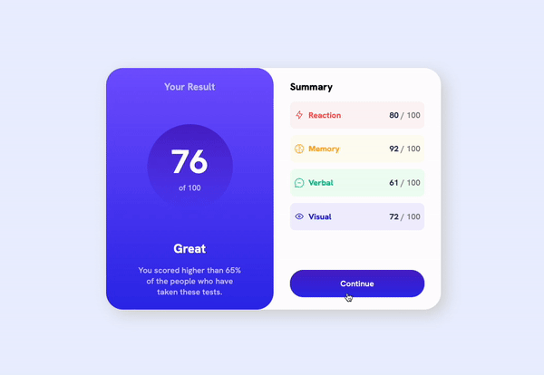
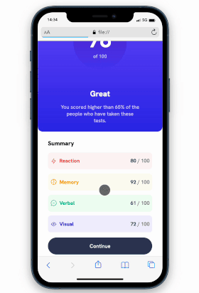

# Frontend Mentor - Results summary component solution

This is a solution to the [Results summary component challenge on Frontend Mentor](https://www.frontendmentor.io/challenges/results-summary-component-CE_K6s0maV). Frontend Mentor challenges help you improve your coding skills by building realistic projects. 
## Table of contents

- [Overview](#overview)
  - [The challenge](#the-challenge)
  - [Screenshot](#screenshot)
  - [Links](#links)
- [My process](#my-process)
  - [Built with](#built-with)
  - [What I learned](#what-i-learned)
  - [Continued development](#continued-development)
  - [Useful resources](#useful-resources)
- [Author](#author)
- [Acknowledgments](#acknowledgments)

## Overview

### The challenge

Users should be able to:

- View the optimal layout for the interface depending on their device's screen size
- See hover and focus states for all interactive elements on the page

### Screenshot





### Links

- Solution URL: [Frontend mentor](https://www.frontendmentor.io/solutions/results-summary-component-solution-with-animated-button-h9FaWOrDd6)


## My process

### Built with

- Semantic HTML5 markup
- CSS custom properties
- Flexbox
- CSS Grid

### What I learned
 It is my second time trying to solve this challanges and i'm proud of myself, it's important to celebrate small achievements.

 learned some new things in CSS:
 ```css
@keyframes anima {
  0%{
    transform: scale(1);
  }
  100%{
    transform: scale(1.03);
  }
}

.btn:hover{
  background-image: linear-gradient(hsla(256, 72%, 46%, 1), hsl(241, 81%, 54%));
  animation-name: anima;
  animation-duration: 0.7s;
  animation-timing-function: ease-in-out;
  animation-iteration-count: infinite;
  animation-direction: alternate;
}

```
 
### Continued development
The challenges have helped me a lot, to keep practicing and challenging myself to try new things and see things from another perspective.
I want to continue with my studies in CSS and already start some things in JS, and I intend to use some frameworks.

### Useful resources

- [Box Shadow video tutorioal - PT-BR](https://www.youtube.com/watch?v=xrftarUZl44&t=302s&ab_channel=dpw) - It helped me to have a better understanding with Box Shadow in CSS.

## Author

- Frontend Mentor - João Vicente Watanabe[@joaowatanabe](https://www.frontendmentor.io/profile/joaowatanabe)
- Twitter - [@wabemusic](https://www.twitter.com/wabemusic)
